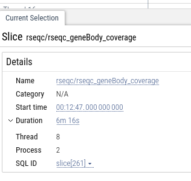

# galaxy workflow invocation to chrome event trace

Convert your workflow invocations into a zoomable, browseable view to help you debug scheduling issues.

The [chrom event trace](https://docs.google.com/document/d/1CvAClvFfyA5R-PhYUmn5OOQtYMH4h6I0nSsKchNAySU/edit) 
formatted files can be loaded in [Perfetto](https://ui.perfetto.dev/). 

An [example trace file](trace-3ea263bb1a48ea14.json) is included in this repository.

You can click on individual jobs to see job information, as well as nice human readable things like runtime:

## LICENSE

AGPL-3.0-or-later
