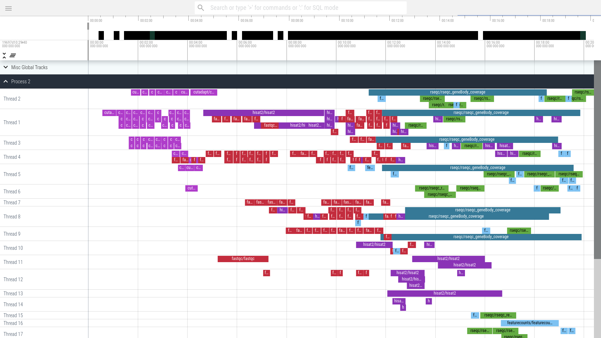

# galaxy workflow invocation to chrome event trace

Convert your workflow invocations into a zoomable, browseable view to help you debug scheduling issues. 

The trace files can be loaded in [Perfetto](https://ui.perfetto.dev/). An [example trace file](trace-3ea263bb1a48ea14.json) is included in this repository.

## LICENSE

AGPL-3.0-or-later
